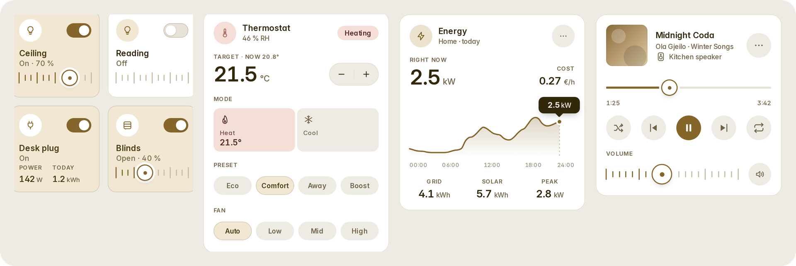
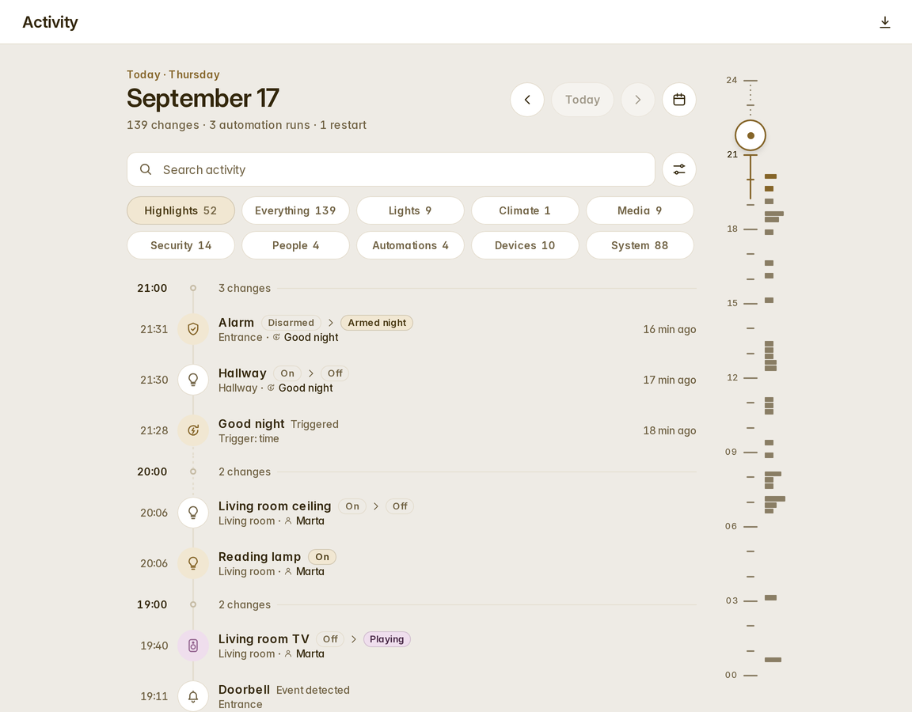
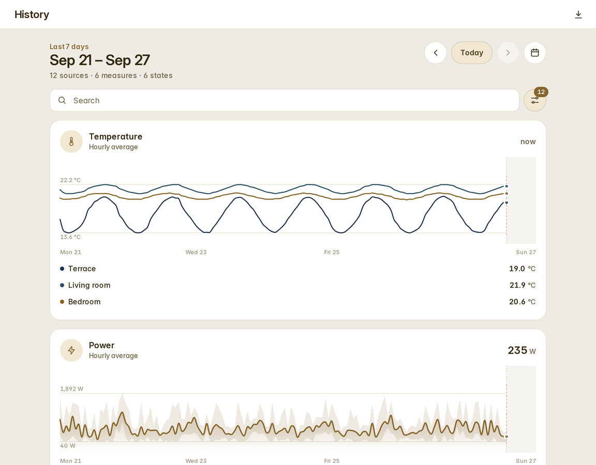
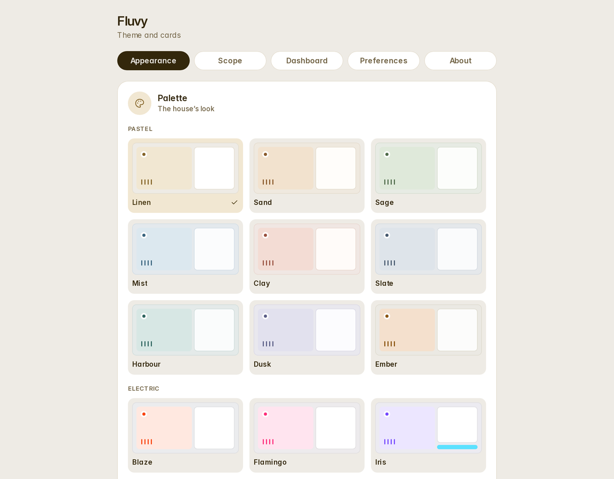

<p align="center">
  <picture>
    <source media="(prefers-color-scheme: dark)" srcset="brand/mark-dark.svg">
    
  </picture>
</p>

<h1 align="center">Fluvy</h1>

<p align="center">A calm theme and card library for Home Assistant.</p>

<p align="center">
  <a href="https://hacs.xyz"></a>
  <a href="https://github.com/acosta290/fluvy/releases/latest"></a>
  <a href="https://www.home-assistant.io"></a>
  <a href="LICENSE"></a>
  <a href="https://github.com/acosta290/fluvy/actions/workflows/ci.yml"></a>
  <a href="https://github.com/acosta290/fluvy/actions/workflows/hassfest.yml"></a>
  <a href="https://github.com/acosta290/fluvy/actions/workflows/hacs.yml"></a>
</p>

<p align="center">
  <picture>
    <source media="(prefers-color-scheme: dark)" srcset="docs/images/hero-dark.png">
    
  </picture>
</p>

<p align="center">
  <picture>
    <source media="(prefers-color-scheme: dark)" srcset="docs/images/activity-dark.png">
    
  </picture>
  <picture>
    <source media="(prefers-color-scheme: dark)" srcset="docs/images/history-dark.png">
    
  </picture>
  <picture>
    <source media="(prefers-color-scheme: dark)" srcset="docs/images/panel-dark.png">
    
  </picture>
</p>

Fluvy brings one design to the whole of Home Assistant: a theme, thirty-nine cards, an automatic dashboard, a
settings panel, the Activity and History pages, and Home Assistant's own pages restyled to match — all from one
set of design tokens, installed as one integration through HACS.

## What you get

- **One theme, light and dark**, generated from the same tokens the cards are drawn with. Sixteen palettes in a
  pastel and an electric line, or your own accent, and three shapes — chosen in the settings panel and applied live
  on every screen, no reload.
- **Thirty-nine cards** for lights, climate, energy, media, security, covers, fans, vacuums, calendars, clocks,
  helpers, people, weather, plants and more. Every card has an editor form, a live preview in the card picker,
  and draws its `unavailable`, `unknown` and missing states on purpose.
- **An automatic dashboard**: `strategy: { type: custom:fluvy-home }` builds Home, Lights, Climate, Energy, Media
  and Sensors from your areas, devices and energy preferences.
- **A settings panel** in the sidebar: appearance for the house, personal preferences for each person, where the
  look applies, the automatic dashboard, language, motion and haptics.
- **Activity and History pages** in the same idiom, standing in for Home Assistant's logbook and history pages
  while the house wants them.
- **Everywhere**: while Home Assistant wears the Fluvy theme, its own pages — Settings, dialogs, forms, the
  sidebar, the quick search — take the same design. It can be limited to your dashboards.
- **English and Spanish**, in every card, page and dialog.

## Installation

[](https://my.home-assistant.io/redirect/hacs_repository/?owner=acosta290&repository=fluvy&category=integration)

Fluvy needs Home Assistant 2026.9 or newer, HACS, and one line most installations already have in
`configuration.yaml` — the theme is a file in your `themes` folder, and this is how Home Assistant reads it:

```yaml
frontend:
  themes: !include_dir_merge_named themes
```

1. In HACS, open the menu (⋮) → **Custom repositories**, add `https://github.com/acosta290/fluvy` with the type
   **Integration**, or click the button above. (Fluvy is a custom repository: HACS's default store only lists
   licences GitHub can identify, and it does not identify the PolyForm Noncommercial licence.)
2. Search for **Fluvy** in HACS and download it.
3. Restart Home Assistant.
4. Go to **Settings → Devices & services → Add integration**, search for **Fluvy** and add it. There is nothing to
   configure: the integration puts the settings panel in the sidebar, loads Fluvy on every page and installs the
   theme.
5. Reload the browser, then choose the **Fluvy** theme: in your profile (**Theme → Fluvy**), or from the panel's
   *Scope* tab, which offers it.

Without HACS: download `fluvy.zip` from the [latest release](https://github.com/acosta290/fluvy/releases/latest),
unzip it into `<config>/custom_components/fluvy/`, restart, and continue at step 4.

If something is missing — the theme line above, a resource that has to be added by hand because your dashboards
are configured in YAML, an old manual install — Home Assistant tells you in **Settings → System → Repairs**, with
exactly what to add or remove.

## First steps

Open **Fluvy** in the sidebar.

- **Appearance** — the palette, the shape and the buttons, for the house; each person can keep their own.
- **Scope** — where the look applies: your dashboards only, or everywhere in Home Assistant; whether the frame,
  the icons and the pages are Fluvy's.
- **Dashboard** — create the automatic dashboard with one button, or add a dashboard of your own with
  `strategy: { type: custom:fluvy-home }` in its raw configuration.
- **Preferences** — language, motion and haptics, per person.

The cards are in the card picker under **Fluvy · …**, each with a preview; `docs/cards.md` lists them with their
options.

## Documentation

| | |
| --- | --- |
| [Installation](docs/installation.md) | HACS or the release zip, updating, uninstalling, what the integration registers, the Repairs it can raise |
| [Getting started](docs/getting-started.md) | the first ten minutes |
| [The settings panel](docs/settings-panel.md) | the five tabs, house and personal settings, where they are stored |
| [The theme](docs/theme.md) | palettes, custom accents, shapes, the tokens |
| [The cards](docs/cards.md) | every card, with its configuration |
| [The automatic dashboard](docs/automatic-dashboard.md) | what it builds from your home, and how to steer it |
| [Activity and History](docs/pages.md) | the two pages |
| [Everywhere](docs/shell.md) | what the shell restyles, and what to expect after a Home Assistant release |
| [Troubleshooting](docs/troubleshooting.md) | when something looks wrong |
| [Development](docs/development.md) | the repository, the build, the tools |
| [Design language](design/language.md) | the specification every card is built and reviewed against |

## Compatibility

Home Assistant **2026.9** or newer. The theme, the shell and the pages are checked against each Home Assistant
release; a release can change a page the shell restyles, and `docs/shell.md` says what happens then. Fluvy runs in
every current browser and in the Companion apps. Lit is bundled, pinned to the version Home Assistant ships; there
is no other runtime dependency, and Fluvy makes no network requests of its own.

## Contributing

Issues and pull requests are welcome. `CONTRIBUTING.md` has the development setup, the conventions, and the
licensing terms a contribution accepts; `CODE_OF_CONDUCT.md` applies to every space of the project.

## Licence

Fluvy is free for personal and other non-commercial use under the
[PolyForm Noncommercial License 1.0.0](LICENSE): you may use it, change it and share it, but not sell it or use it
as part of a commercial product or service. Third-party work it ships is listed in
[THIRD_PARTY_NOTICES.md](THIRD_PARTY_NOTICES.md). For a commercial use, open an issue.

## Acknowledgements

[Lit](https://lit.dev) (Google, BSD-3-Clause); [Material Design Icons](https://pictogrammers.com/library/mdi/)
(Pictogrammers, Apache-2.0), used to map Home Assistant's icons to Fluvy's glyphs;
[Inter](https://rsms.me/inter/) (The Inter Project Authors, SIL OFL 1.1); and
[Home Assistant](https://www.home-assistant.io) and its frontend (Apache-2.0), which Fluvy is built for and is not
affiliated with.
